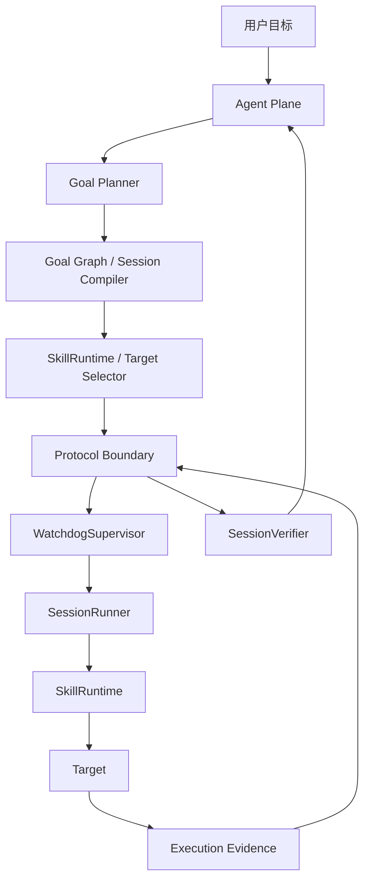

# PhyAgentOS：面向具身智能体的认知—物理解耦、自进化运行时系统精读笔记

> 论文：**PhyAgentOS: A Self-Evolving Operating System for Embodied Agents with Decoupled Cognitive Planning and Physical Execution**<br>
> 版本：PhyAgentOS v0.1.6，2026-07-21<br>
> arXiv：2607.16636v1<br>
> 本笔记以论文正文为主要依据，并补充理解该论文所需的具身智能、VLA、World Model、Agent、ROS、适配器、状态机、记忆系统等前置知识。
> **说明：标记为“前置知识补充”或“分析”的部分是为了帮助理解而加入的解释，不属于论文原文结论。**

## 一、研究背景与前置知识

### 1. 论文定位与核心问题

**论文研究的对象**

PhyAgentOS 研究的并不是一个新的机器人基础模型，也不是一种新的 VLA（Vision-Language-Action）网络结构。它研究的是一个更高层的**系统问题**：

> 当 LLM Agent、VLA、World Model、机器人控制器、仿真环境和真实硬件同时参与一个具身任务时，谁来负责统一调度、验证任务是否真的完成、记录失败原因、复用历史经验，并保证整个执行链安全？

论文认为，当前具身智能已经拥有很多“局部很强”的组件：

- VLA 擅长从视觉和语言直接生成动作；
- World Model 擅长预测执行某个动作之后世界可能变成什么样；
- Agent 擅长理解高层任务、分解目标、使用工具并进行长程规划；
- ROS 擅长连接传感器、执行器和机器人软件节点。

但这些组件直接拼在一起，并不会自动得到一个可靠的具身智能系统。

论文把缺失的那一层定义为一种 **Embodied AI Operating System / Physical Agent Operating System**，即位于高层认知与低层物理执行之间的系统运行时。

因此，PhyAgentOS 的核心定位可以写成：

```text
它不是新的“机器人脑模型”
而是管理“机器人脑如何安全、可验证地驱动物理世界”的系统层。
```

**Verification Gap：执行结束不等于任务完成**

论文用“抓杯子”解释最核心的问题。

假设用户要求：

```text
抓起桌上的杯子
```

执行链可能表现为：

```text
Agent：
我已经规划了抓取任务
    ↓
VLA：
轨迹已经生成并执行
    ↓
控制器：
机械臂到达目标位置，夹爪已经闭合
    ↓
程序：
所有函数都正常返回
```

传统软件系统可能由此认为：

```text
Task Success
```

但真实情况可能是：

```text
夹爪闭合在空气中
杯子仍然留在桌面上
```

此时真正发生的是：

```text
Execution terminated successfully
≠
Semantic task completed successfully
```

即：

> **动作执行成功，不代表任务语义成功。**

论文将这种结构性缺口称为 **verification gap（验证缺口）**。

执行器通常只能回答：

```text
“我是否按要求执行了动作？”
```

而用户真正关心的是：

```text
“世界是否已经变成任务要求的状态？”
```

前者是**执行层状态**，后者是**任务语义状态**。

PhyAgentOS 的一个核心目标就是在二者之间增加显式的语义验证层。

**简单组合 VLA、World Model 和 Agent 仍然不足**

论文进一步指出，即使把：

```text
Agent + World Model + VLA
```

全部组合起来，也会遇到三个结构性问题。

第一是**抽象层级不兼容**。

不同模块处理的对象完全不同：

```text
Agent
    → 任务、子目标、工具调用、符号状态

World Model
    → latent state、未来状态、轨迹预测

VLA
    → 图像、语言 token、连续动作或动作块

Robot Controller
    → 关节角、速度、力矩、控制频率
```

这些模块之间没有天然统一的状态表示，因此往往需要大量 ad-hoc converter。

第二是**黑盒叠加导致故障定位更困难**。

假设一个十步任务失败：

```text
LLM 规划错误？
↓
工具参数错误？
↓
World Model 预测错误？
↓
VLA 产生错误动作？
↓
坐标转换错误？
↓
机器人控制器跟踪失败？
↓
传感器观测错误？
```

如果没有明确的系统边界和记录，很难知道失败究竟发生在哪一层。

第三是**经验无法自然跨 Session 持久化**。

例如：

```text
第一次：
某种抓法对细长杯子失败
→ 调整抓取角度后成功

第二次：
再次遇到相似杯子
```

若系统没有持久记忆，第二次可能仍然从零开始，再犯一次相同错误。

论文因此认为，问题不只是“模型不够聪明”，而是缺乏一个负责：

```text
统一状态
→ 调度
→ 执行监督
→ 语义验证
→ 故障归因
→ 经验积累
→ 安全约束
```

的系统层。

---

### 2. 理解论文所需的前置知识


**Embodied AI 与 Physical Agent**

**前置知识补充。**

Embodied AI（具身智能）的基本思想是：

> 智能体不仅处理文本或图像，而是通过身体与环境交互，并让自己的行为改变环境。

典型回路是：

```text
环境
 ↓
传感器
 ↓
Observation
 ↓
Agent / Policy
 ↓
Action
 ↓
执行器
 ↓
环境发生变化
 ↓
新的 Observation
```

数学上可以把环境交互粗略表示为：

$$
s_{t+1} \sim P(s_{t+1}\mid s_t,a_t)
$$

其中：

- $s_t$：时刻 $t$ 的环境状态；
- $a_t$：智能体在时刻 $t$ 执行的动作；
- $P$：环境动力学；
- $s_{t+1}$：动作之后的新状态。

与纯文本 Agent 不同，具身智能面临一个额外事实：

> 错误的输出不仅是“回答错了”，还可能真实改变物理世界。

因此执行权限、实时性、设备约束、验证和安全都会成为核心系统问题。

**VLA：Vision-Language-Action**

VLA 可以粗略理解为：

```text
视觉
+
自然语言指令
    ↓
模型
    ↓
机器人动作
```

例如：

```text
图像：桌面上有红杯子
指令：把红杯子放进盒子
    ↓
VLA
    ↓
机械臂动作序列
```

常见输入包括：

- RGB 图像；
- 深度图；
- 语言指令；
- 机器人 proprioception；
- 历史动作。

输出可能是：

- 末端执行器位姿；
- 关节位置；
- 关节速度；
- gripper open/close；
- 一段连续动作，即 action chunk。

论文将 OpenVLA、$\pi_0$、$\pi_{0.5}$、X-VLA 等都视为可以插入 PhyAgentOS 的 Policy backend。

因此 PhyAgentOS 与 VLA 的关系不是：

```text
PhyAgentOS 替代 VLA
```

而是：

```text
PhyAgentOS
   ↓ 管理
VLA Policy
   ↓ 产生动作
物理目标
```

VLA 负责“产生智能动作”，PhyAgentOS 负责“这些动作如何被允许、转换、监督、记录、验证”。

**World Model**

**前置知识补充**

World Model 学习的是：

> 当前世界是什么状态，以及执行某个动作之后，世界可能如何变化。

抽象地可以写为：

$$
\hat{s}_{t+1}=f_\theta(s_t,a_t)
$$

或者预测未来多步：

$$
\hat{s}_{t+1:t+H}
=
f_\theta(s_t,a_{t:t+H-1})
$$

World Model 可以用于：

- look-ahead planning；
- 模拟候选动作；
- 预测风险；
- 生成未来视觉状态；
- model-based control。

但论文指出，World Model 本身并不负责完整的系统级执行契约，也不天然知道：

```text
这个动作是否有权限执行？
这个机器人支持这种动作格式吗？
任务语义是否最终满足？
失败经验是否应该永久保存？
```

因此 PhyAgentOS 把 World Model 视为潜在的**预测模块**，而不是整个系统本身。

**Agentic System**

Agentic System 通常是：

```text
用户目标
 ↓
LLM / Foundation Model
 ↓
Reasoning
 ↓
Task decomposition
 ↓
Tool selection
 ↓
执行
 ↓
观察结果
 ↓
继续 reasoning
```

典型思想包括：

- ReAct；
- tool calling；
- planning；
- reflection；
- long-term memory；
- multi-step reasoning。

PhyAgentOS 保留 Agent 的认知能力，但明确限制：

> Agent 不应该直接获得无边界的硬件控制权限。

论文把 Agent 更像是一个**控制塔**：

```text
决定“做什么”
而不是直接负责“电机应该怎么转”
```

**ROS 与 Middleware**

ROS 名字中虽然包含 Operating System，但从系统软件角度更准确地说，它主要提供：

- 节点通信；
- publish / subscribe；
- service；
- action；
- message；
- hardware abstraction；
- 软件包生态。

论文认为 ROS 更像：

```text
机器人通信与软件中间件
```

而不是负责全部高级具身智能生命周期的 OS。

论文所说的缺失能力包括：

- task-level scheduling；
- persistent cross-session memory；
- semantic verification；
- 统一安全管理；
- Agent 与执行层之间的标准契约；
- 跨目标的统一 Session 生命周期。

因此 PhyAgentOS 并不是简单要“替代 ROS”。

更准确的理解是：

```text
高层 Agent / VLA / World Model
        ↓
     PhyAgentOS
        ↓
ROS / SDK / Simulator / Game API
        ↓
真实或虚拟执行目标
```

**Policy、Runtime、Target 与 Adapter**

这几个术语是全文最重要的工程概念之一。

**Policy**

负责产生动作的策略：

```text
Observation
 ↓
Policy
 ↓
Action
```

Policy 可以是：

- VLA；
- diffusion policy；
- learned controller；
- 其他机器人策略。

**SkillRuntime**

负责某一类技能如何被运行。

论文有两种主要 SkillRuntime：

```text
PolicySkillRuntime
BuiltinSkillRuntime
```

**Target**

真正被控制的执行对象，例如：

- Minecraft；
- Stardew Valley；
- MuJoCo / LIBERO simulation；
- Franka；
- PIPER；
- humanoid robot。

**Adapter**

用于转换不同组件的表示。

如果 Policy 输出：

```text
[x, y, z, roll, pitch, yaw, gripper]
```

而机器人 SDK 需要：

```text
joint_1 ... joint_7
```

中间就需要适配层。

论文主要涉及：

```text
PolicyAdapter
TargetAdapter
ActionBridge
```

三者不能混淆。

- `PolicyAdapter`：在统一观察/动作协议与具体模型格式之间转换；
- `TargetAdapter`：在统一 Target 接口与具体设备 SDK / simulation API 之间转换；
- `ActionBridge`：处理跨表示但应独立于模型和设备的动作转换，如坐标系、单位、维度投影、重采样等。

**Session、状态机与事务式执行**


**前置知识补充**

Session 可以理解为一个具有生命周期的任务事务。

传统做法可能只关注：

```text
execute(action)
```

而 PhyAgentOS 关注：

```text
创建任务
→ 检查
→ 获取执行权
→ 运行
→ 心跳监控
→ 收集证据
→ 等待验证
→ 成功 / 失败 / 重规划
```

论文 Figure 8 给出的状态过程可以概括为：

```text
pending
  ↓
claimed
  ↓
running
  ↓
finalizing
  ↓
awaiting verification
  ↓
verifying
  ↓
terminal
```

terminal 之后语义上可能得到：

```text
succeeded
failed
replanned
```

Session 的关键作用是提供一个**完整执行边界**。

它不像单个动作那样只存在几毫秒，而是可以覆盖：

- 多次 observation；
- 多个 action chunk；
- 重试；
- timeout；
- cancellation；
- evidence collection。

**DAG 与任务依赖**

**前置知识补充**

论文提到 Goal Graph，可将长任务表示为 DAG：

$$
G=(V,E)
$$

其中：

- $V$：子任务节点；
- $E$：依赖关系；
- DAG：Directed Acyclic Graph，有向无环图。

例如：

```text
找到杯子
   ↓
走到杯子旁
   ↓
抓住杯子
   ↓
找到柜子
   ↓
打开柜门
   ↓
放入杯子
```

若“抓住杯子”失败，就不应该继续“放入杯子”。

DAG 的意义是允许系统判断：

```text
哪些节点 ready
哪些节点 blocked
哪些节点需要重新规划
哪些下游节点已经失效
```

需要注意：论文在架构部分描述了 Goal Graph / Session Compiler，但在 Future Work 中明确说明 **DAG 级 Goal Graph 和 Session Compiler 尚未完全实现**。

---

## 二、总体解决思路

### 1. 论文的总体解决思路


**从单向流水线改造成闭环系统**

传统具身执行通常像：

```text
用户指令
 ↓
规划
 ↓
动作生成
 ↓
机器人执行
 ↓
结束
```

PhyAgentOS 将其改造成：

```text
用户指令
 ↓
Agent 理解目标
 ↓
编译 Session Contract
 ↓
Runtime Preflight
 ↓
受监督执行
 ↓
收集 Evidence
 ↓
SessionVerifier
 ├─ success
 ├─ failure
 └─ replan
      ↓
经验写入 Memory
      ↓
影响未来 Planning
```

其关键变化是：

```text
执行
不是流程终点
```

真正的流程终点是：

```text
执行
→ 验证
→ 经验更新
```

这样才能形成闭环。

**五个核心机制**

论文在第 4 节把系统能力组织为五个主要机制：

```text
统一 Cognitive State Space
        ↓
SessionVerifier
        ↓
Epistemic Memory
        ↓
Benchmarking
        ↓
Layered Safety
```

它们不是五个互相独立的插件，而具有明显依赖关系：

```text
统一状态
    ↓
验证器才能比较“目标”和“结果”
    ↓
验证之后才知道哪些经验可信
    ↓
可信经验才能进入长期记忆
    ↓
大量重复 Session 才能用于 Benchmark
    ↓
所有执行必须被 Safety 限制
```

因此论文真正的因果链是：

```text
Explicit State
→ Verifiable Execution
→ Verified Experience
→ Persistent Adaptation
→ Measurable Self-Evolution
```

---

## 三、系统架构与 Session-Centered Runtime

### 1. 整体系统架构


**Agent Plane 与 Runtime Plane**


论文 Figure 3 将系统划分为两个主要平面：



二者的核心职责可以概括为：

```text
Agent Plane
= What should be done?

Runtime Plane
= How should it be executed safely and controllably?
```

Agent 负责：

- 理解用户请求；
- 融合上下文；
- 制定目标；
- 分解任务；
- 选择 SkillRuntime；
- 选择 Target；
- 根据验证结果重新规划。

Runtime 负责：

- compatibility preflight；
- Session 生命周期；
- observation-action loop；
- timeout / cancel；
- heartbeat；
- adapter chain；
- evidence collection；
- physical safety。

**认知规划与物理执行解耦**


论文的关键设计约束是：

> Agent 不允许直接发 raw hardware command。

Agent 产生的是一个结构化 Session。

Session 至少包含：

```text
Task Goal
Selected SkillRuntime
Selected Target
Preconditions
Execution Limits
Acceptance Criteria
```

然后 Runtime 自己：

```text
claim Session
→ 验证契约
→ 建立执行链
→ 执行
→ 返回证据
```

因此两边不需要直接 import 对方的实现。

这就是论文标题中的：

```text
Decoupled Cognitive Planning
and
Physical Execution
```

**为什么解耦很重要**

如果认知和执行写在同一个进程中：

```text
LLM
 ↓
直接调用机器人 SDK
 ↓
动作执行
```

会产生几个问题：

- 机器人 SDK 与 Agent 强绑定；
- 新机器人需要重写大量 Agent 逻辑；
- LLM 的延迟可能进入控制路径；
- 安全权限边界模糊；
- 失败难以定位；
- Agent bug 可能直接影响执行器。

解耦后：

```text
Agent
只产生“可执行契约”

Runtime
只接受满足约束的契约
```

因此 Agent 可以更换，机器人也可以更换。

---

### 2. Session-Centered Runtime


**为什么最小执行单位是 Session 而不是 Action**

论文第二个很重要的设计思想是：

> 对物理任务进行治理时，不能只看一个孤立动作，而应该看完整 Session。

单个动作只包含：

```text
a_t
```

但一个任务通常包含：

```text
观察
→ 动作
→ 再观察
→ 再动作
→ timeout
→ retry
→ terminate
→ verify
```

因此要对一个任务做：

- compatibility check；
- heartbeat；
- cancellation；
- retry；
- evidence collection；
- acceptance；

必须有一个更大的生命周期容器。

这个容器就是 Session。

**WatchdogSupervisor**

`WatchdogSupervisor` 是 Runtime 的监督入口。

它负责：

```text
claim pending Session
↓
检查 Runtime Contract
↓
Compatibility Preflight
↓
生成 AdapterPlan
↓
创建 SessionRunner
↓
监控 heartbeat
↓
处理 timeout / cancel
↓
收集 terminal result
↓
写回协议文件
```

关键点是：

> WatchdogSupervisor 负责 **supervision**，不负责高频 control。

它不会自己执行：

```text
observe
→ inference
→ action
```

否则 Supervisor 又会重新变成一个巨大的耦合模块。

**Compatibility Preflight**

在真实机器人上，很多错误应该在执行之前发现。

例如：

```text
Policy 需要 RGB-D
但 Target 只有 RGB
```

或者：

```text
Policy 输出 Cartesian velocity
Target 只接受 joint position
```

或者：

```text
Policy 控制频率要求 50 Hz
目标接口只能稳定支持 5 Hz
```

如果这些问题等到机器人开始运动后才发现，风险很高。

所以论文引入 Preflight：

```text
SkillRuntime Requirements
+
Policy Requirements
+
Target Capabilities
+
Adapter Availability
+
Safety Configuration
        ↓
Compatibility Preflight
        ↓
Valid / Invalid
```

若 valid，则构造：

```text
AdapterPlan
TargetToolManifest
```

若 invalid，则：

```text
Reject before target access
```

这一点很像传统操作系统或编译系统中的“在运行之前完成类型/资源检查”。

**SessionRunner**

通过 Preflight 后，`SessionRunner` 接管具体执行生命周期。

它负责：

- configure；
- start；
- reset；
- observe；
- 调用 SkillRuntime；
- 检查 termination；
- 收集 evidence；
- refresh perception；
- 维护 Session 状态。

可以把 Runtime 的责任逐层理解为：

```text
WatchdogSupervisor
    ↓
管理整个任务生命周期

SessionRunner
    ↓
管理本次具体执行

SkillRuntime
    ↓
定义执行策略

Target
    ↓
与环境/机器人真正交互
```

---

## 四、双执行流与适配链

### 1. 双执行流：Policy 与 Agent Tool Loop


**Policy-driven Execution**

针对 VLA 等连续控制模型，论文采用 `PolicySkillRuntime`。

公式为：

$$
A_t=\operatorname{Policy}(I,O_t,S_t,H_t)
$$

其中：

- $A_t$：时刻 $t$ 的 action 或 action chunk；
- $I$：自然语言 instruction；
- $O_t$：当前 observation；
- $S_t$：当前 state；
- $H_t$：历史信息。

这里需要特别注意：

> 这不是一个训练损失函数，也不是论文提出的新神经网络公式。

它只是用于描述 Runtime 接口关系的**系统级抽象表达式**。

实际执行流程是：

```text
Target Observation
 ↓
统一 Observation Contract
 ↓
PolicyAdapter
 ↓
模型需要的 Tensor / Message
 ↓
Policy Inference
 ↓
模型原始输出
 ↓
PolicyAdapter
 ↓
标准 Action / Action Chunk
 ↓
ActionBridge
 ↓
SafetyGuard
 ↓
TargetAdapter
 ↓
Target
```

**Action Chunk**

**前置知识补充。**

Action chunk 指模型一次不只预测一个动作，而是预测未来一段动作：

$$
A_t=
[a_t,a_{t+1},\ldots,a_{t+K-1}]
$$

优点包括：

- 降低每一步都推理的计算开销；
- 提高时间一致性；
- 适合 diffusion / flow based policy。

但也会产生系统问题：

```text
模型一次生成 20 步
↓
执行到第 5 步时环境已经变化
↓
后面的 15 步还应该执行吗？
```

所以 PhyAgentOS 的 Action Runtime 需要管理：

- buffer；
- truncation；
- interruption；
- control frequency；
- replanning boundary。

这就是为什么“模型动作”不能直接等价为“设备命令”。

**Agent-directed Tool Execution**


另一条路径是 `BuiltinSkillRuntime`。

它适合：

- 游戏；
- 离散工具；
- scripted procedure；
- robot primitive；
- benchmark orchestration。

论文给出：

$$
T_t=\operatorname{Agent}(I,O_t,S_t,H_t)
$$

其中：

- $I$：任务指令；
- $O_t$：当前 observation；
- $S_t$：系统/环境状态；
- $H_t$：历史上下文；
- $T_t$：论文用来表示通过 `TargetSessionHandle` 暴露的受控工具交互。

其逻辑不是：

```text
Agent → raw motor command
```

而是：

```text
Agent
 ↓
TargetSessionHandle
 ↓
允许使用的 Tool Manifest
 ↓
参数验证
 ↓
Adapter
 ↓
Target
```

可暴露操作可能包括：

```text
observe
reset
invoke_tool
step
query_state
```

具体可用工具由 Session 的权限策略筛选。

因此：

```text
Agent 可以在线决策
≠
Agent 拥有无限硬件权限
```

**两条执行路径为什么必须统一**


两种模式表面差异很大：

```text
Policy-driven
→ 模型自动连续地产生 action

Agent-directed
→ Agent 每一步选择 tool
```

但它们最终都必须统一为：

```text
Session
→ Watchdog supervision
→ Target
→ Evidence Bundle
→ SessionVerifier
```

这样后续的：

- 验证；
- benchmark；
- memory；
- failure diagnosis；
- safety；

才不需要知道“底层行为到底来自 VLA 还是 Agent”。

这是论文系统抽象非常重要的一点。

---

## 五、State-as-a-File 与统一认知状态

### 1. State-as-a-File：把认知—物理边界变成文件协议


**核心设计**


论文最具辨识度的设计是：

> 不把 Agent—Runtime 边界设计成直接函数调用，而是设计成可读、可解析、可版本化的文件协议。

跨进程状态被写入：

```text
Markdown
+
embedded YAML
```

因此：

```text
Agent
 ↓
读取/写入 protocol file
 ↓
Runtime
```

而不是：

```text
Agent process
 ↓ direct import / RPC
Runtime implementation
```

作者称其为：

```text
State-as-a-File
```

**五个主要协议文档**

Figure 7 给出五个主要协议文档。

**SESSIONS.md**

负责：

- task objective；
- Session ID；
- selected SkillRuntime；
- selected Target；
- dependency；
- precondition；
- acceptance criteria；
- lifecycle state；
- execution result；
- evidence。

它是整个架构的**事务中心**。

**SKILLRUNTIME.md**

描述：

- 能力；
- 需要什么 observation；
- 产生什么 action；
- orchestration mode；
- configurable parameters；
- adapter requirements。

它回答：

```text
“这个任务方法需要怎样被运行？”
```

**TARGETS.md**

描述：

- target type；
- capabilities；
- observation modalities；
- action semantics；
- endpoints；
- operational constraints。

它回答：

```text
“这个执行对象能做什么？”
```

**ENVIRONMENT.md**

保存经过感知处理后的结构化环境状态：

```text
entities
attributes
relations
state changes
```

它不是把所有相机原始像素全部复制进去，而是保存适合跨层推理的语义状态。

**LESSONS.md**

保存：

- 失败目标；
- evidence；
- diagnosed cause；
- corrective action；
- correction 是否后来得到验证。

**扩展协议文件**


论文其他部分还出现：

```text
KNOWLEDGE.md
SKILL.md
TASK.md
LOG.md
RUNTIME_SIGNAL.md
```

以及部署配置：

```text
sensors.yaml
perception.yaml
runtime_contract.yaml
safety.yaml
```

核心思想是把两类信息分开：

```text
语义状态
→ Markdown Protocol

部署与工程参数
→ YAML Config
```

例如：

```text
“杯子应该放入柜子”
```

属于 Session 语义。

而：

```text
最大机械臂速度 = ...
```

属于 safety configuration。

**文件协议为什么有价值**

这种设计的收益包括：

**可检查**

人可以直接阅读：

```text
为什么任务被执行？
选了哪个机器人？
选择哪个 Skill？
结果是什么？
```

**可版本控制**

可以使用 Git 或其他版本机制观察状态变化。

**松耦合**

Agent 与 Runtime 不需要知道彼此代码实现。

**语言无关**

Agent 可以用 Python，Runtime 可以使用其他语言，只要都理解协议。

**天然形成审计记录**

如果采用 append-only attempts：

```text
第一次失败
↓
第二次 replan
↓
第三次成功
```

整个历史不会因为最终成功而被覆盖。

**文件协议的代价**


论文自己承认当前协议通过 polling 工作：

```text
Watchdog
定期读取 SESSIONS.md

Agent
定期读取协议更新
```

因此调度延迟大约会受到 polling interval 影响。

此外还必须保证：

```text
single-writer semantics
+
atomic update
```

否则可能出现：

```text
Runtime 正在写一半
Agent 恰好读取
→ 得到 partial state
```

所以 State-as-a-File 并不是“文件一定比 RPC 更先进”。

它实际上选择的是：

```text
低耦合
可审计
实现简单
可恢复
```

来交换：

```text
低延迟
高吞吐
复杂并发能力
```

---

### 2. Unified Cognitive State Space


**为什么需要共享认知状态**

不同组件看到的是不同世界：

```text
Agent：
目标、符号、任务依赖

Runtime：
Session 状态、heartbeat、adapter

Policy：
Tensor、视觉、robot state

Target：
设备原生传感器和控制接口
```

如果它们只通过私有对象交换信息，就没有一个“全系统共同承认的状态”。

PhyAgentOS 因此把协议文件组合起来，形成：

```text
Unified Cognitive State Space
```

它并不是机器学习里的 latent space，而更像一个：

> 跨认知层与执行层共享的结构化语义状态空间。

**Environment 的结构化**

原始观察可能是：

```text
RGB
Depth
Point Cloud
LiDAR
Proprioception
Symbolic Event
```

Perception Pipeline 将其转换成：

```text
Entity
Attribute
Relation
State Change
```

例如：

```text
Raw RGB
 ↓
Perception
 ↓
cup:
  position: table
  inside: false

cabinet:
  open: true
```

于是 Agent 不必直接对所有原始 sensor stream 工作。

它可以推理：

```text
cup is on table
cabinet is open
```

同时 Runtime 仍保留证据指针，知道这些语义状态来源于哪些 observation。

**Cloud–Edge 边界**

论文还利用这套状态协议划分 Cloud 与 Edge。

Cloud / Cognitive Plane 可以运行：

- 大模型；
- multimodal reasoning；
- memory retrieval；
- long-horizon planning。

Edge / Runtime 可以运行：

- Watchdog；
- SessionRunner；
- control loop；
- SafetyGuard；
- target-local constraints。

因此网络上传输的是：

```text
粗粒度 State / Session / Evidence
```

而不是：

```text
每个 1 ms 的电机控制命令
```

这很重要，因为网络：

- 有延迟；
- 会抖动；
- 会断开。

真实机器人高频控制不能依赖远端 LLM 的实时响应。

---

## 六、SessionVerifier 与语义验收

### 1. SessionVerifier：从“动作完成”升级到“语义验收”


**验证函数**


论文将验证器抽象为：

$$
V(G,S_0,S_T,\tau,H)
\rightarrow
\{\text{success},\text{failure},\text{replan}\}
$$

变量含义：

- $G$：Goal，任务目标与 acceptance criteria；
- $S_0$：执行前初始环境状态；
- $S_T$：执行结束后的最终环境状态；
- $\tau$：execution trace；
- $H$：相关历史信息。

输出：

- `success`；
- `failure`；
- `replan`。

同样需要强调：

> 这是系统接口抽象，不是论文提出的可微分损失函数。

Verifier 可以由不同实现组成：

- deterministic predicate；
- task-specific evaluator；
- multimodal model；
- tool-assisted review；
- manual review。

真正稳定的是：

```text
输入 evidence schema
+
输出 verdict semantics
```

而不是某个固定模型。

**为什么必须同时有 $S_0$ 和 $S_T$**


这是论文中一个很重要的细节。

如果只看最终图像：

```text
杯子在柜子里
```

你并不知道：

```text
是机器人刚刚放进去的？
还是任务开始前它就在那里？
```

任务成功通常描述的是**状态变化**：

$$
S_0 \rightarrow S_T
$$

例如：

```text
closed → open
table → cabinet
not grasped → grasped
unsafe → safe
```

所以 Verifier 必须同时知道 initial state 和 terminal state。

**Evidence Bundle**


Verifier 不应只读取：

```text
return_code = 0
```

而是读取完整 Evidence Bundle：

- task definition；
- initial observation；
- terminal observation；
- initial `ENVIRONMENT.md` snapshot；
- terminal environment snapshot；
- action-observation history；
- target-native event；
- task-specific metric；
- verifier configuration；
- historical context。

因此：

```text
Controller Success
```

只是证据中的一个字段，而不是最终真相。

**三种 Verdict**


**success**

表示 evidence 满足 acceptance criteria：

```text
Session → succeeded
```

**failure**

表示任务目标未完成：

```text
Session → failed
```

并进入：

```text
diagnosis
→ lesson extraction
```

**replan**

表示：

```text
当前执行不能简单接受
但也不应该直接终止整个高层目标
```

此时创建：

```text
Child Session
```

原 Session 不被重写。

即：

```text
Attempt 1
failed / replan
   ↓
Child Session
   ↓
Attempt 2
```

这样历史是 immutable / append-only 的。

**Verification 与 Controller Status 的本质区别**


可以把它们写成：

```text
Controller：
“执行命令是否完成？”

Verifier：
“任务要求的世界状态是否成立？”
```

因此论文真正想把系统从：

```text
Execution-centric
```

升级为：

```text
Outcome-centric
```

---

## 七、自进化与 Epistemic Memory

### 1. 自进化：Epistemic Memory 与 Trial-and-Error Loop


**“Self-Evolving” 的准确含义**


这是最容易误解论文标题的地方。

PhyAgentOS 所说的 Self-Evolving **首先不是**：

```text
自动修改神经网络权重
```

也不是：

```text
每次失败后在线 fine-tune VLA
```

论文明确把自进化首先定义为一种**系统级适应**：

```text
历史执行
→ 经过语义验证
→ 形成知识/教训
→ 改变未来 Context
→ 改变未来 Strategy
→ 改变未来 Skill Selection
```

因此即使模型参数 $\theta$ 完全不变，系统仍可能：

```text
第二次比第一次做得更好
```

**六阶段闭环**


论文给出的 trial-and-error loop 可以整理为：

```text
Execute
   ↓
Verify
   ↓
Diagnose
   ↓
Revise
   ↓
Re-verify
   ↓
Consolidate
```

**Execute**

通过正常 Runtime 执行 Session。

**Verify**

SessionVerifier 给出语义 verdict。

**Diagnose**

结合：

- task contract；
- environment transition；
- runtime event；
- prior lesson；

推断失败原因。

**Revise**

修改：

- subgoal；
- runtime；
- target configuration；
- action method；
- execution strategy。

**Re-verify**

新的策略重新执行，仍然使用相同 acceptance semantics。

**Consolidate**

只有新策略确实得到验证后，才进入持久知识。

这一顺序非常重要：

```text
猜测一个修复方法
≠
已经学到一个正确经验
```

必须：

```text
Hypothesis
→ Execution
→ Verification
→ Knowledge
```

**多层记忆**


论文把记忆拆成不同类型。

**Episodic Memory**

主要对应：

```text
SESSIONS.md
```

保存具体经历：

- task；
- trace；
- evidence；
- verdict；
- parent-child relation。

像人的：

```text
“上一次我做了什么？”
```

**Working Memory**

对应：

```text
ENVIRONMENT.md
```

保存当前任务相关世界状态。

像：

```text
“现在发生了什么？”
```

**Semantic Memory**

对应：

```text
KNOWLEDGE.md
LESSONS.md
```

保存跨 episode 抽象出的规律。

例如：

```text
这种杯子从顶部抓取容易滑落
```

**Procedural Memory**

对应：

```text
SKILL.md
SKILLRUNTIME.md
```

保存：

```text
“这种任务应该怎么做？”
```

**KNOWLEDGE 与 LESSONS 的区别**


`KNOWLEDGE.md` 更偏成功经验：

```text
成功模式
适用条件
来源 Target
来源 Runtime
性能
```

`LESSONS.md` 更偏失败修正：

```text
失败目标
证据
诊断原因
纠正方式
纠正方式是否后来成功
```

这一区分非常重要。

如果失败之后 Agent 说：

```text
“可能是因为角度太小”
```

这只是 hypothesis。

只有后续：

```text
增大角度
→ 重新执行
→ Verifier 判定 success
```

之后，才应把它提升为可信 lesson。

**Memory Retrieval**


新 Session 生成之前，ContextBuilder 按：

- goal；
- environment；
- target type；
- risk factor；

检索相关 memory。

然后将匹配经验注入 planning context。

论文特别强调经验必须携带：

```text
provenance
+
scope
```

也就是说：

```text
在 Franka 上成功
```

不能自动推出：

```text
在所有机器人上一定成功
```

尤其接触丰富的 manipulation strategy 很可能依赖：

- gripper geometry；
- controller frequency；
- workspace；
- robot morphology。

因此跨 embodiment 复用必须检查 precondition。

---

## 八、Benchmarking 与分层安全

### 1. Benchmarking：为什么评价本身也是系统机制


**部署路径与评价路径统一**


传统研究中经常有：

```text
Deployment Runtime
```

和：

```text
Evaluation Script
```

两套不同代码。

这会造成一个问题：

```text
Benchmark 测到的系统
可能不是实际部署的系统
```

例如两边：

- preprocessing 不同；
- timeout 不同；
- action chunk 不同；
- success 判断不同。

PhyAgentOS 要求：

```text
Benchmark
也编译成 Session
```

所以：

```text
普通任务
    ↓
Watchdog
→ Runner
→ SkillRuntime
→ Target
→ Verifier

Benchmark Episode
    ↓
Watchdog
→ Runner
→ SkillRuntime
→ Target
→ Verifier
```

使用同一路径。

**Availability Gate**


Benchmark 开始前先检查：

```text
Target available?
Policy available?
Runtime available?
Adapter compatible?
Observation contract satisfied?
Action contract satisfied?
Safety config valid?
```

如果不满足：

```text
明确失败
```

而不是：

```text
跳过部分 episode
然后悄悄算一个看似正常的平均值
```

**Benchmark Session Compiler**


任务与初始状态被展开成：

```text
Task × Initial State
       ↓
Pending Sessions
```

每个 Session 记录：

- task source；
- random seed / state ID；
- Runtime；
- Target；
- evaluation config；
- acceptance criteria。

这提高了 reproducibility。

**Benchmark 与 Self-Evolution 的关系**


一次恢复成功可能只是偶然。

所以：

```text
某个 Session 成功
≠
系统真的变强
```

只有大量固定条件实验才能判断：

```text
旧版本
vs
加入经验后的版本
```

究竟是否稳定改善。

因此 Benchmark 在论文中不仅是“最后用于写表格”，而是：

```text
Self-Evolution 的测量装置
```

---

### 2. 五层安全机制


**Defense-in-Depth**


论文不是依赖一个 Safety Module，而是采用多层防御：

```text
Compatibility Preflight
        ↓
Action Bridge
        ↓
SafetyGuard
        ↓
Heartbeat Monitoring
        ↓
Target-local Constraints
```

不同层处理不同失败类型。

**Compatibility Preflight**


处理的是：

```text
这个组件组合从一开始是否合法？
```

检查：

- modality；
- schema；
- coordinate convention；
- control frequency；
- endpoint；
- operation permission。

如果不兼容：

```text
机器人还没有被访问
Session 就已经被拒绝
```

这是最外层防线。

**Action Bridge**


处理的是：

```text
抽象动作如何被确定性地转换
```

例如：

- coordinate transform；
- unit normalization；
- joint reordering；
- dimension projection；
- gripper remapping；
- chunk resampling。

Action Bridge 的核心职责是：

```text
Representation Transformation
```

而不是判断行为是否安全。

**SafetyGuard**


SafetyGuard 回答的是：

```text
转换后的命令是否允许真正执行？
```

检查包括：

- dtype；
- dimension；
- NaN；
- infinity；
- joint limit；
- workspace；
- velocity；
- acceleration；
- duration；
- action frequency；
- emergency-stop state。

可能处理方式：

```text
Reject
Safe Halt
Authorized Clamp
```

同时记录 violation code。

**Heartbeat Monitoring**


即使 action 本身合法，也可能发生：

```text
Policy Server 卡死
Network 断开
Target Runtime 崩溃
Runner 不再响应
```

所以 Watchdog 持续监控：

```text
SessionRunner heartbeat
Policy heartbeat
Target heartbeat
```

如果心跳失效：

```text
Timeout
→ Cancellation
→ Controlled Termination
```

避免：

```text
系统已经失联
但旧 Action Chunk 仍然继续控制机器人
```

**Target-local Constraints**


最内层也是最终权威。

机器人本地仍应保留：

- joint limit；
- collision detection；
- torque limit；
- velocity limit；
- controller watchdog；
- workspace；
- hardware E-stop。

关键原则：

```text
PhyAgentOS Safety
不能替代 Robot-native Safety
```

而是叠加其上。

因此安全链条可以概括为：

```text
组合是否合法
→ 转换是否正确
→ 命令是否允许
→ 系统是否仍健康
→ 设备最终是否允许
```

---

## 九、Progressive Validation 与实验结果

### 1. 实验设计：Progressive Validation


**为什么从游戏开始**


论文面对一个实验困难：

```text
真实机器人
最真实
但昂贵、慢、危险

Simulation
安全、便宜
但存在 sim artifact

Game
几乎没有真实物理噪声
但无法验证物理控制
```

所以作者没有把三者看成互相替代，而是组成：

```text
Game
 ↓
Simulation
 ↓
Real Robot
```

逐步加入变量。

其核心实验思想是 controlled variable。

**Game Tier**

尽量去掉：

- actuator error；
- sensor noise；
- rigid-body uncertainty；
- physical latency。

主要测：

- planning；
- memory；
- risk reasoning；
- self-evolution。

**Simulation Tier**

加入：

- dynamics；
- collision；
- persistent physical state；
- control latency。

主要测：

- policy execution；
- failure recovery；
- semantic verification。

**Real Robot Tier**

进一步加入：

- hardware noise；
- sensor uncertainty；
- communication problems；
- safety critical constraints。

**这一实验方法想证明什么**


如果：

```text
Game 成功
Simulation 失败
```

就说明问题更可能来自：

```text
Physical Execution
```

而非高层 planning。

如果：

```text
Game 都失败
```

则没有必要立刻怀疑机器人控制。

因此 progressive validation 试图提供更强的故障归因能力：

```text
Cognition
→ Dynamics
→ Hardware
```

逐层验证。

---

### 2. Game Tier：认知能力验证


**三种环境**


论文选了：

```text
Minecraft
Stardew Valley
Don't Starve
```

它们对应不同认知压力。

**Minecraft**

测试：

- sparse feedback；
- resource acquisition；
- crafting；
- long-horizon planning。

**Stardew Valley**

测试：

- time；
- money；
- energy；
- farming；
- trade；
- social；
- multi-resource scheduling。

**Don't Starve**

测试：

- hunger；
- health；
- sanity；
- season；
- irreversible death；
- long-term risk。

因此游戏难度不是简单越来越“操作困难”，而是越来越强调：

```text
长期状态管理与风险控制
```

**Game Tier 的统一运行方式**


所有游戏实验仍走：

```text
SESSIONS.md
 ↓
WatchdogSupervisor
 ↓
SessionRunner
 ↓
TargetAdapter
 ↓
Game
 ↓
SessionVerifier
 ↓
Epistemic Memory
```

也就是说作者不是只拿游戏当普通 Benchmark，而是用游戏测试整套协议与认知循环。

**Optimus-67**


Optimus-67 有 67 个 Minecraft 长任务，按难度分为：

- Wood；
- Stone；
- Iron；
- Gold；
- Diamond；
- RedStone；
- Armor。

PhyAgentOS 的成功率为：

| Task Group | PhyAgentOS |
|---|---:|
| Wood | 0.99 ± 0.01 |
| Stone | 0.96 ± 0.05 |
| Iron | 0.52 ± 0.19 |
| Gold | 0.06 ± 0.08 |
| Diamond | 0.19 ± 0.07 |
| RedStone | 0.30 ± 0.16 |
| Armor | 0.15 ± 0.06 |

最明显的是 RedStone：

```text
PhyAgentOS 0.30
Optimus-3  0.29
Optimus-2  0.28
```

作者将优势归因于：

- SessionVerifier；
- Epistemic Memory；
- redstone recipe reuse。

但需要注意：这是作者给出的机制解释，单靠表格本身并不能完全分离两个机制各自贡献，需要更细粒度的 ablation 才能严格归因。

**StarDojo**


PhyAgentOS 使用：

```text
deepseek-v4-flash
text-only
```

总体成功率：

```text
22.0%
```

任务分类表现：

| 能力 | PhyAgentOS |
|---|---:|
| Farming | 28.6% |
| Crafting | 50.0% |
| Exploration | 17.9% |
| Combat | 16.7% |
| Social | 8.0% |
| Total | 22.0% |

论文指出 Crafting 的提升最明显。

另外：

```text
Easy   37.5%
Medium  3.7%
Hard    0.0%
```

这意味着虽然总分领先部分 baseline，但真正复杂任务仍然远未解决。

这也提醒我们：

> PhyAgentOS 改善系统性执行与经验复用，并不意味着高层模型的能力上限被消除。

**DST-Dojo**


Don't Starve 实验比较：

```text
Raw LLM
vs
Raw LLM + PhyAgentOS
```

主要结果：

| Metric | Raw LLM | + PhyAgentOS |
|---|---:|---:|
| Survival Days | 1.02 ± 0.08 | 2.10 ± 0.88 |
| Day 3 Survival | 0% | 30% |
| Death by Charlie | 90% | 80% |
| Death by Monster | 10% | 10% |
| Death by Starvation | 0% | 10% |

平均生存天数增加约：

$$
\frac{2.10-1.02}{1.02}\times 100\%
\approx 106\%
$$

值得注意的是：

- Health；
- Hunger；
- Sanity；

平均值反而更低。

论文解释并不是能力退化，而是：

```text
Raw LLM 很早死亡
→ 没有经历长期资源消耗

PhyAgentOS 活得更久
→ 饥饿、理智等资源真正被长期消耗
```

因此不能机械地把“状态平均值更高”理解为“更好的 survival”。

---

### 3. Simulation Tier：物理执行回归


**First 与 Final**


Simulation 实验采用很重要的一组定义：

```text
First
= Policy 第一次原始尝试

Final
= 第一次失败后，允许 PhyAgentOS 介入恢复之后的最终结果
```

因此：

```text
Final - First
```

衡量的不是 Policy 本身变强了多少，而是：

> **系统级验证与恢复机制能挽救多少原本失败的执行。**

同时论文强调：

- 不 fine-tune Policy；
- 不改变 nominal task goal；
- 不放宽 benchmark success criteria。

**LIBERO**


四个 backend：

- OpenVLA；
- $\pi_0$；
- $\pi_{0.5}$；
- X-VLA。

总体变化：

| Model | First | Final | Gain |
|---|---:|---:|---:|
| OpenVLA | 74.5% | 75.5% | +1.0 |
| $\pi_0$ | 92.8% | 93.2% | +0.4 |
| $\pi_{0.5}$ | 97.0% | 97.8% | +0.8 |
| X-VLA | 97.3% | 98.6% | +1.3 |

这里增益不大，一个重要原因是：

```text
原始成功率已经很高
→ 可恢复失败样本有限
```

因此 ceiling effect 明显。

**CALVIN**


CALVIN 每个 episode 是：

```text
5 个连续子任务
```

并且：

```text
子任务之间不 reset
```

所以前面的误差会传播到后面。

关键指标是：

```text
k/5
```

表示至少成功完成前 $k$ 个子任务的比例。

最终 5/5：

| Model | First | Final | Gain |
|---|---:|---:|---:|
| X-VLA | 74.3% | 75.7% | +1.4 |
| $\pi_0$ | 38.9% | 45.6% | +6.7 |
| $\pi_{0.5}$ | 85.3% | 89.4% | +4.1 |

尤其 $\pi_0$ 的完整链成功率：

```text
38.9%
→
45.6%
```

说明长程任务中的部分失败并不是完全不可恢复，而是：

```text
中途执行偏差
+
缺少及时恢复
```

**RoboCasa365**


RoboCasa365 使用厨房家庭环境：

- articulated object；
- clutter；
- multi-view；
- household activity；
- long horizon。

250 episodes：

```text
18 atomic skills
+
32 composite activities
```

结果：

| Model | First Overall | Final Overall | Gain | Rescued |
|---|---:|---:|---:|---:|
| $\pi_{0.5}$ | 17.6% | 26.8% | +9.2 | 23 |
| RLDX-1 | 35.6% | 42.8% | +7.2 | 18 |
| WorldDreamer | 34.0% | 42.4% | +8.4 | 21 |

这个实验的增益比 LIBERO 明显得多。

原因可以从任务性质理解：

```text
环境更复杂
↓
原始失败更多
↓
其中一部分是可恢复执行失败
↓
Verifier + Recovery 有更多作用空间
```

**Simulation 结果真正证明了什么**


这些结果更适合支持：

```text
系统级 failure recovery
对多个 policy backend 都有价值
```

而不能直接支持：

```text
PhyAgentOS 让 VLA 模型本身学会了更多能力
```

因为：

```text
Policy weight 没改
```

它提升的是：

```text
Policy
+
Verification
+
Recovery
+
Runtime
```

形成的**系统成功率**。

---

### 4. Real-Robot：跨硬件部署与安全


**多种 Target**


论文列出的执行平台覆盖：

- industrial arm；
- desktop arm；
- dual arm；
- quadruped；
- wheeled humanoid；
- biped humanoid；
- dexterous hand。

这部分主要用于验证：

```text
统一 Protocol
+
Adapter Chain
```

能否覆盖不同 embodiment。

**Zero-shot Cross-Embodiment 的正确理解**


论文强调同一个：

```text
Agent Protocol
+
SESSIONS.md
```

可以驱动不同机器人。

切换：

```text
TargetAdapter
PolicyAdapter
```

即可改变 embodiment。

这里的“zero-shot transfer”主要应该理解为：

> 高层认知/协议逻辑不需要为每台机器人重新编写。

它并不等于：

> 任意 VLA Policy 的低层控制策略可以不经任何适配就直接跨机器人泛化。

因为论文仍然显式依赖：

- TargetAdapter；
- PolicyAdapter；
- target-specific safety；
- target-specific configuration。

**Safety Validation**


论文描述三类真实硬件测试：

**Preflight rejection**

故意提供不兼容 adapter config：

```text
是否能在 motor command 产生前拒绝？
```

**SafetyGuard**

注入越界或超速 action chunk：

```text
是否能够拦截或 clamp？
```

**Emergency stop latency**

测量：

```text
Violation detected
→
Motor halt
```

之间的延迟。

不过当前论文版本在正文中主要描述了测试设计，没有像 Simulation Benchmark 那样给出完整的数值结果表。

---

## 十、端到端机制、贡献与批判性分析

### 1. 论文最核心的端到端执行过程


**正常成功路径**


可以把整篇论文压缩为下面这条执行链：

```text
User Request
 ↓
ContextBuilder
 ↓
Goal Planner
 ↓
Goal / Subtask
 ↓
Session Compiler
 ↓
SkillRuntime + Target Selection
 ↓
SESSIONS.md
 ↓
Watchdog claims Session
 ↓
Compatibility Preflight
 ↓
AdapterPlan + ToolManifest
 ↓
SessionRunner
 ↓
SkillRuntime
 ↓
Policy / Agent Tool Loop
 ↓
ActionBridge
 ↓
SafetyGuard
 ↓
TargetAdapter
 ↓
Target
 ↓
Observation / Event
 ↓
Evidence Bundle
 ↓
SessionVerifier
 ↓
success
 ↓
KNOWLEDGE / Episode Record
```

**失败恢复路径**


```text
Execution
 ↓
Evidence
 ↓
SessionVerifier
 ↓
failure / replan
 ↓
Diagnose
 ↓
LESSONS retrieval / update
 ↓
Revise Strategy
 ↓
Child Session
 ↓
Re-execute
 ↓
Re-verify
 ↓
Verified recovery
 ↓
Consolidate
```

**系统各组件的责任边界**


可以用一句话分别记忆：

```text
Agent
决定做什么

Session
规定这次任务是什么

Watchdog
决定任务能否和何时被执行，并监督它

Runner
管理本次具体执行

SkillRuntime
定义如何执行这类技能

Policy
产生动作

Adapter / Bridge
负责表示转换

SafetyGuard
判断动作是否允许

Target
真正改变环境

Verifier
判断目标是否真的实现

Memory
让未来不再完全从零开始
```

---

### 2. 论文创新点的准确理解


**创新主要属于系统架构**


这篇论文最重要的贡献不是提出新的网络结构，而是重新定义：

```text
具身 AI 各组件如何组合
```

其主要系统思想包括：

- Session-Centered Runtime；
- State-as-a-File；
- Agent / Runtime decoupling；
- Unified Cognitive State Space；
- Evidence-grounded SessionVerifier；
- Epistemic Memory；
- deployment-identical benchmarking；
- layered safety。

因此阅读它时，不应该一直寻找：

```text
新的 Transformer layer 在哪里？
新的 loss function 在哪里？
```

真正要问的是：

```text
系统边界如何划分？
状态如何流动？
权限如何限制？
失败如何恢复？
证据如何保存？
经验如何复用？
```

**“OS” 是运行时抽象，不是传统 Kernel**


PhyAgentOS 并不是在论文中提出：

- CPU scheduler；
- virtual memory；
- page table；
- device driver kernel；
- process isolation kernel。

所以它与 Linux 这类通用操作系统不是同一种层次。

它的“OS”更接近：

```text
Embodied Agent Runtime Platform
```

因为它试图提供具身智能中的系统级公共服务：

- scheduling；
- memory；
- verification；
- safety；
- benchmarking；
- adapter abstraction。

因此更准确的理解是：

> 作者借用 Operating System 的思想，把分散在应用代码中的公共执行治理能力提升为统一运行时服务。

**State-as-a-File 是实现方式，也是架构契约**


它的意义不仅是：

```text
“用 Markdown 保存数据”
```

而是通过文件把边界固定下来：

```text
Agent 不需要直接 import Runtime
Runtime 不需要知道 Agent 内部 reasoning
```

真正关键的是：

```text
Explicit Contract
```

而不是 `.md` 这个文件后缀本身。

---

### 3. 实验结果与核心论点之间的对应关系


**Game Tier 支持的论点**


Game 实验主要支持：

```text
Persistent Memory
Planning
Retry
Self-Evolution
```

能够在低物理噪声环境中工作。

它不能证明：

```text
真实机器人控制已经解决
```

**Simulation Tier 支持的论点**


Simulation 实验主要支持：

```text
Semantic Verification
+
Recovery
```

能够围绕多种 VLA backend 提升系统成功率。

它支持“model-agnostic operating layer”这一方向，但仍然依赖具体 adapter 与环境。

**Real Robot 支持的论点**


真实机器人部分主要支持：

```text
协议/适配器可跨 embodiment
+
安全机制可以部署到物理系统
```

不过论文自己也承认，真实机器人实验覆盖仍有限，重点更多在 safety-critical validation，而非大规模任务成功率统计。

**Progressive Validation 的整体论证关系**


作者的论证链可以写成：

```text
游戏
证明认知闭环能运行
        ↓
Simulation
证明遇到物理动态后仍有系统级恢复收益
        ↓
Real Robot
证明协议和安全机制能够触达真实硬件
```

因此三层实验不是三组独立 benchmark，而是在支撑一个统一论点：

> 同一个认知—执行协议与 Runtime，可以跨不同物理真实性层级复用。

---

### 4. 局限性


**Polling Latency**


当前系统通过 polling 检查文件更新。

因此：

$$
T_{\text{response}}
\gtrsim
T_{\text{poll interval}}
$$

实际延迟还需要加上：

- parsing；
- scheduling；
- model inference；
- network；
- device latency。

这使文件协议不适合直接承担毫秒级控制总线。

论文未来考虑：

```text
filesystem watcher
+
event-driven protocol
```

但必须继续保证：

```text
atomic write
single writer
consistency
```

**Long-Horizon Memory Growth**


如果长期运行：

```text
LESSONS.md ↑
KNOWLEDGE.md ↑
SESSIONS.md ↑
```

最终会出现：

- retrieval cost；
- context budget；
- irrelevant memory；
- contradictory lesson；
- stale knowledge。

目前 ContextBuilder 采用：

```text
task-type matching
+
recency weighting
```

论文明确承认缺少严格的检索保证。

也就是说：

```text
记住很多
≠
每次都能找回最正确的经验
```

**Skill Promotion 缺乏形式化保证**


成功策略可以提升为 Skill。

但：

```text
在若干测试上成功
```

并不能严格推出：

```text
面对所有合理状态都安全、正确
```

当前仍依赖：

- threshold；
- benchmark；
- regression test；
- semi-manual QA。

论文把更严格的 skill-quality foundation 列为未来方向。

**Real-Robot Coverage**


真实硬件虽然覆盖了多种平台和适配目标，但真正大规模统计仍不足。

论文自己指出：

> 当前 real-robot 评价更关注 safety-critical validation，而不是大规模 task completion statistics。

因此当前证据更适合证明：

```text
Architecture can reach real hardware
```

而不是：

```text
已经证明在所有 19+ embodiment 上具有稳定任务性能
```

---

### 5. 未来工作


**Goal Graph 与 Session Compiler**


未来目标是把独立 Session 扩展成真正的 DAG：

```text
Task
 ↓
Goal Graph
 ↓
Multiple Sessions
 ↓
跨 Agent / 跨 Robot Dependency
```

例如：

```text
移动机器人
先把物品运到机械臂工作区
        ↓
机械臂
再完成抓取装配
```

两者通过 TASK / Session dependency 协调，而不是写定制同步代码。

**World Model 深度集成**


目前 World Model 更多作为外部能力。

未来可用于：

```text
Proposed Session
 ↓
World Model Rollout
 ↓
预测是否可能成功
 ↓
SessionVerifier / Planner
 ↓
决定是否真的消耗物理资源
```

这对真实机器人非常重要，因为：

```text
Simulation Failure
代价低

Physical Failure
可能昂贵甚至危险
```

**Event-driven Protocol**


目标：

```text
Polling
 ↓
Filesystem Event
 ↓
Lower Scheduling Latency
```

但必须避免：

```text
half-written state
race condition
multiple writer conflict
```

**Fleet-scale Cross-Embodiment**


未来要真正测试：

- legged robot；
- aerial platform；
- soft robot；
- radically different morphology。

并衡量：

```text
新增一种 embodiment
究竟需要写多少 adapter code？
```

这才可以量化论文声称的 portability。

**Memory 与 Skill 的理论基础**


作者希望进一步回答：

```text
什么时候 Memory 一定能找回最相关 Lesson？

多少成功率足以把 Strategy 提升为 Skill？

Skill 在什么条件下才可以跨环境泛化？
```

这意味着当前“self-evolution”仍主要是工程系统机制，还缺乏完整理论保证。

---

### 6. 论文中需要特别谨慎理解的地方


**Self-Evolution 不等于 Online Training**


错误理解：

```text
PhyAgentOS 会自动重新训练机器人神经网络
```

更准确：

```text
PhyAgentOS 首先通过
Memory + Verification + Replanning + Skill reuse
实现系统级自进化
```

模型 fine-tuning 只是未来可能加入的进一步 consolidation mechanism。

**Semantic Verification 不等于绝对真值**


Verifier 本身也可能犯错。

因为它可能由：

- VLM；
- predicate；
- task evaluator；
- human/tool review；

构成。

因此真正可靠的是：

```text
Evidence-grounded
+
Traceable
+
Append-only
```

而不是“Verifier 永远正确”。

**Zero-shot Cross-Embodiment 不等于零适配**


论文仍然需要：

```text
TargetAdapter
PolicyAdapter
Safety Config
```

所谓复用主要是：

```text
Agent logic
Session protocol
Runtime governance
```

不随机器人改变。

**Final Benchmark Performance 不是原始 Policy Performance**


Simulation 表格中：

```text
First
```

才更接近原始 policy 一次执行能力。

```text
Final
```

是：

```text
Policy + PhyAgentOS recovery
```

的系统表现。

因此不能用 Final 数字直接说：

```text
“$\pi_0$ 模型准确率变成了 45.6%”
```

正确说法是：

> 在 $\pi_0$ 作为 backend 时，加入 PhyAgentOS 的 verifier-triggered recovery 后，CALVIN 5/5 系统完成率从 38.9% 提升到 45.6%。

---

### 7. 对论文论证力度的分析


**论证较强的部分**


**系统问题定义明确**

“执行结束 != 语义成功”是一个非常清楚的工程问题。

**组件边界清晰**

Agent、Runtime、SkillRuntime、Target、Verifier 的责任拆分具有较强工程可解释性。

**同一执行路径用于 Deployment 与 Benchmark**

这有助于减少 evaluation harness 与 production runtime 不一致的问题。

**多 Policy Backend 的 Simulation 结果**

LIBERO、CALVIN、RoboCasa365 都表现出 Final > First，为“恢复层具有模型无关价值”提供了跨模型证据。

**当前证据相对不足的部分**


**缺乏细粒度机制消融**

例如：

```text
只有 Verifier
只有 Memory
只有 Retry
Verifier + Memory
完整系统
```

这样的组件消融在当前版本正文中不充分。

因此某些提升很难严格归因到单一模块。

**Verifier 本身的准确率没有被系统量化**

如果核心贡献之一是 semantic acceptance，那么理想情况下还应详细测量：

- false positive；
- false negative；
- human agreement；
- verifier latency。

当前版本更强调端到端结果。

**恢复成本没有充分讨论**

Final > First 可能伴随：

- 更多 inference；
- 更多 steps；
- 更多 latency；
- 更多能源；
- 更多 token cost。

成功率提升很重要，但实际机器人系统还需要衡量 recovery cost。

**Real Robot 统计仍有限**

这一点论文自己也承认。

**当前版本中值得注意的表述差异**


论文正文与表格中存在少量当前版本需要谨慎核对的表述。

例如：

- 摘要主要写 `Optimus-67`，结论处又出现 `Optimus-3`；
- 正文称 Franka Research 3 是主要 manipulation platform，但 Table 7 对 Franka FR3 的 Real Robot / Tested 标记与该叙述并不完全直观一致；
- Future Work 又说明 Goal Graph / Session Compiler 尚未完全实现，而架构图已经把它作为正式模块展示。

这些不一定意味着核心思想错误，更可能反映 v0.1.6 仍然处于快速迭代阶段。但在引用论文能力时应区分：

```text
Architecture Design
Current Implementation
Experimental Validation
Future Planned Capability
```

不能把四者全部视为已经完全验证的同一层次事实。

---

## 十一、论证结构与最终心智模型

### 1. 整篇论文的论证结构


**问题链**


```text
VLA / World Model / Agent 各自很强
              ↓
但没有统一系统层
              ↓
执行结果缺乏语义验证
              ↓
错误难以归因
              ↓
经验无法稳定跨 Session 保留
              ↓
跨机器人复用困难
              ↓
安全机制碎片化
```

**设计目标链**


```text
解耦 Cognition 与 Physics
        ↓
建立统一 Session
        ↓
显式记录跨层 State
        ↓
统一 Runtime Governance
        ↓
Evidence-based Verification
        ↓
Persistent Memory
        ↓
Self-Evolution
```

**实现机制链**


```text
State-as-a-File
        ↓
Session-Centered Runtime
        ↓
WatchdogSupervisor
        ↓
SessionRunner
        ↓
SkillRuntime
        ↓
Adapter / Bridge
        ↓
Target
        ↓
Evidence Bundle
        ↓
SessionVerifier
        ↓
Epistemic Memory
```

**验证链**


```text
Game
验证 Cognition
   ↓
Simulation
验证 Physical Regression 与 Recovery
   ↓
Real Robot
验证 Hardware Integration 与 Safety
```

因此整篇论文不是“提出很多互不相关模块”，而是在回答一个连续问题：

> 怎样让一个具身 Agent 从“会规划、会产生动作”，进一步变成一个“能够被系统性治理、能够知道自己是否真的完成任务、能够从经过验证的失败中积累经验，并能安全地迁移到不同执行目标”的长期运行系统？

---

### 2. 最重要的概念关系


**Model Intelligence 与 System Reliability**


这篇论文隐含了一个非常重要的系统观点：

```text
更聪明的 Model
≠
更可靠的 System
```

因为实际系统成功率不仅取决于：

$$
\text{Policy Capability}
$$

还取决于：

$$
\text{System Success}
=
f(
\text{Planning},
\text{Policy},
\text{Adapter},
\text{Execution},
\text{Verification},
\text{Recovery},
\text{Safety}
)
$$

上式是理解论文的概念表达，不是论文给出的正式公式。

一个 95% 成功率的 Policy，如果没有：

- error detection；
- retry；
- timeout；
- safety；
- semantic verification；

仍可能是一个不可靠的机器人系统。

**Decoupling 与 Generalization**


论文强调跨 embodiment 的真正关键不一定是：

```text
让一个神经网络直接理解所有机器人
```

还可以通过：

```text
高层语义保持不变
+
低层差异封装在 Adapter
```

来实现系统级 portability。

这和计算机系统中的经典思想相似：

```text
Application
不直接控制所有硬件细节

Operating System / Driver
提供稳定抽象
```

PhyAgentOS 想在具身智能中建立类似分层。

**Verification 与 Learning**


没有 Verification：

```text
失败轨迹
```

只是：

```text
一段不知道好坏的数据
```

有 Verification 后：

```text
Trajectory
+
Verdict
+
Evidence
```

才可能变成：

```text
可学习经验
```

因此论文中的逻辑是：

$$
\text{Learning from Experience}
\Longrightarrow
\text{Experience must first be judged}
$$

换句话说：

> **验证是系统级学习的前提。**

**Memory 与 Self-Evolution**


如果 Memory 只是无限追加日志：

```text
记录越来越多
```

不等于：

```text
系统越来越聪明
```

真正的自进化必须同时满足：

```text
Verified Experience
        ↓
Relevant Retrieval
        ↓
Planning Change
        ↓
Behavior Change
        ↓
Measured Improvement
```

所以：

```text
Memory
+
Retrieval
+
Benchmark
```

三者必须同时存在。

---

### 3. 阅读这篇论文时应形成的最终心智模型


可以把 PhyAgentOS 想象成一个**机器人任务操作系统 / 运行时控制塔**。

用户说：

```text
“把杯子放进柜子。”
```

PhyAgentOS 不是直接产生电机信号，而是依次完成：

```text
① Agent：
理解“杯子最终应该位于柜子内部”

② Session：
把这个目标写成可验证任务契约

③ Runtime：
检查 Policy、Target、Adapter 是否兼容

④ Watchdog：
授予并监督本次执行生命周期

⑤ SkillRuntime / Policy：
产生具体动作

⑥ Adapter / Bridge：
把抽象动作转成当前机器人的动作表示

⑦ SafetyGuard：
检查动作是否安全

⑧ Target：
真实执行

⑨ Evidence：
保存执行前后状态、轨迹和事件

⑩ SessionVerifier：
检查“杯子是否真的进柜子”

⑪ 如果失败：
诊断 → 修改 → Child Session → 再执行

⑫ 如果恢复成功：
把已验证经验写入 Knowledge / Lessons

⑬ 下一次：
ContextBuilder 检索经验，避免从零开始
```

因此最核心的一句话不是：

```text
PhyAgentOS 让机器人执行动作
```

而是：

> **PhyAgentOS 试图把“开放式模型生成的意图和动作”变成一种具有明确执行契约、权限边界、可验证结果、持久经验和安全保障的长期具身运行过程。**

---

### 4. 整体总结


PhyAgentOS 的出发点是：当前具身 AI 不再缺少单独优秀的模型，而越来越缺少一个能够把这些模型可靠组合起来的系统层。VLA 可以产生动作，World Model 可以预测未来，Agent 可以规划复杂任务，ROS 可以传递机器人消息，但“谁来治理整个任务生命周期”仍然经常由具体应用临时实现。

论文因此提出：

```text
State-as-a-File
+
Session-Centered Runtime
+
Agent / Runtime Decoupling
+
SessionVerifier
+
Epistemic Memory
+
Unified Benchmark Path
+
Layered Safety
```

其核心闭环为：

```text
Plan
 ↓
Compile Session
 ↓
Preflight
 ↓
Execute
 ↓
Collect Evidence
 ↓
Semantic Verify
 ↓
Diagnose / Replan
 ↓
Consolidate Memory
 ↓
Improve Future Planning
```

其中最值得记住的四个思想是：

1. **执行完成不等于语义任务完成。**<br>
   机器人系统必须显式验证最终世界状态，而不能只相信控制器 return code。

2. **认知与物理执行应该具有明确系统边界。**<br>
   Agent 决定“做什么”，Runtime 负责“如何受控地执行”，二者通过显式 Session Protocol 连接。

3. **自进化首先可以发生在系统层，而不必发生在模型权重层。**<br>
   经过验证的成功和失败可以通过 Memory、Strategy Selection、Skill Promotion 与 Replanning 改变未来行为。

4. **可靠具身智能是系统属性，不只是模型属性。**<br>
   最终任务成功来自 Planning、Policy、Runtime、Adapter、Verification、Recovery 和 Safety 的共同作用。

从研究类型上看，这篇论文更接近：

```text
Embodied AI
+
Agent Runtime
+
Robotic Systems
+
Software Architecture
+
Long-term Memory
+
Safety
```

的交叉系统论文，而不是单纯的深度学习模型论文。

理解这篇论文之后，再阅读它的代码仓库时，最应该追踪的不是某一个神经网络，而是以下几条“状态流”：

```text
Goal 如何进入 Session
Session 如何被 Watchdog claim
Preflight 如何生成 AdapterPlan
Runner 如何驱动 SkillRuntime
Action 如何经过 Adapter / Bridge / SafetyGuard
Evidence 如何写回协议
Verifier 如何改变 Session State
LESSONS / KNOWLEDGE 如何影响下一次 Context
```

只要把这几条状态流真正看懂，PhyAgentOS 的整体设计就基本掌握了。
